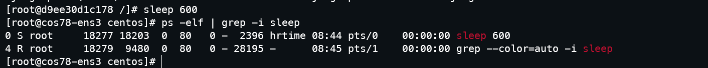
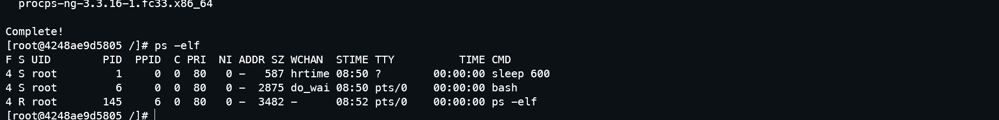
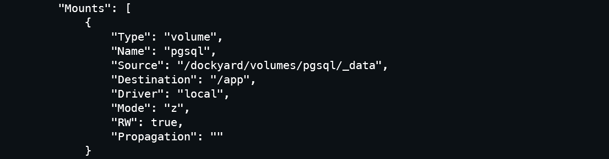

# M2 iLoRD - UE VCC - TP4

## Ressources sur Markdown :

* <https://guides.github.com/features/mastering-markdown/>
* <https://guides.github.com/pdfs/markdown-cheatsheet-online.pdf>
* <https://docs.github.com/en/free-pro-team@latest/github/writing-on-github/basic-writing-and-formatting-syntax#further-reading>

## Compte-rendu du TP4 (pages 21-27 du PDF)

> **Suivre le TP pas-à-pas, et compléter les questions signalées par (§)/TODO**

We'll now start to learn about what had started to be a revolution within clouds:
containers!
A container is a kind of ultra lightweight instance featuring:

* milliseconds to boot,
* one application to run (without deployment hassle),
* better resources utilization (i.e than instances),
* (almost) no overhead.

### 0 - What's all this container stuff, Anyhow?

In many use cases, users apply for (large) instances (i.e high CPU count and memory) … to finally just launch a single application … thus wasting dedicated resources :(

Container's secret: linux namespaces!
Instead of a complete isolation through an emulated hardware along with a dedicated OS … let's run all containers applications on the same host but in different namespaces (ip netns, cgroups …) … that's thin insulation!

**docker images**

Before starting an application within a container, you first ought to retrieve an image.
```
docker pull fedora
```

… coming from https://hub.docker.com (no need for any account)

Your host's OS doesn't matter: here we decided that our next application will get run with Fedora libraries!
That's because containerized applications & libraries only make use of kernel syscalls from host.

**FS mounts and network ports bindings**

In the next picture, we present a traditional use case: exposing an application isolated in a container via a network port reachable from its host (here an instance). The application in the container runs a service on port 8000. This port is mapped to port 80 on host (instance) … thus a http access to this instance will get forwarded to port 8000 in this container.

Behind the hood is a bridge docker0 to whom all containers get attached to with private IPs
(172.17.0.0/16). In addition, iptables rules map ports to/from host.

**docker cli**
In a previous example, we decided to mount a directory from the host to our container (possibly /etc/shadow)… that's one of the reasons why docker is a root-only command.
Later, we'll discover how to give users access to a container.

In addition to what we'll be talking later, you may start to have a look at this excellent docker introduction from Sébastien Binet:
http://m2siame.univ-tlse3.fr/teaching/francois/docker-introduction_dec15.pdf

### 1 - Docker setup @ instance
Before going on with the docker setup in your instance … you first ought to **start an instance** featuring a public IP (same as seen earlier) …

**the VXLAN issue!**
CloudMIP (like many others cloud platforms) make use of Virtual eXtensible LAN (i.e VXLANs). A vxlan
enables overlay networks leading to up to 16 million virtual vlan in a physical vlan. It encapsulates layer2 Ethernet frames within layer 4 UDP frames. VXLAN endpoints, which terminate VXLAN tunnels are known as VXLAN tunnel endpoints (VTEPs) and make use of port 4789.
https://en.wikipedia.org/wiki/Virtual_Extensible_LAN

```
[root@cos76-francois ~]# yum -y install net-tools bind-utils
[root@cos76-francois ~]# ifconfig
eth0: flags=4163<UP,BROADCAST,RUNNING,MULTICAST> mtu 1450
  inet 192.168.0.167 netmask 255.255.255.0 broadcast 192.168.0.255
  inet6 fe80::f816:3eff:fe15:6276 prefixlen 64 scopeid 0x20<link>
  ether fa:16:3e:15:62:76 txqueuelen 1000 (Ethernet)
```

… thus, since there's encapsulation, it means that MTU is shaped down from 1500 to 1450 ...

**docker-ce (Community Edition) setup**

install software:

```
yum -y install yum-utils epel-release
yum-config-manager --add-repo https://download.docker.com/linux/centos/docker-ce.repo
yum -y install docker-ce docker-compose
```
create a directory for dockyard (instead of /var/lib/docker) and set it as default docker dir

```
mkdir /dockyard
```

create docker daemon config file

```
mkdir /etc/docker
```

> /etc/docker/daemon.json

```
{
  "log-driver": "journald",
  "data-root": "/dockyard",
  "storage-driver": "overlay2",
  "storage-opts": [
    "overlay2.override_kernel_check=true"
  ],
  "bip": "172.17.0.1/24",
  "mtu": 1450,
  "fixed-cidr": "172.17.0.0/24"
}
```

… then enable and start service
```
systemctl enable docker
systemctl start docker
```

… watch journal
```
journalctl -efu docker
```

… and test it is functional
```
docker info
docker run hello-world
```

### 2 - Basic docker commands

Find proper image …
```
docker search fedora
```

Note: Alpine Linux is the default Linux system installed in almost all constrained systems

retrieve latest fedora container (or specific version)
```
docker pull fedora
or
docker pull fedora:latest
or
docker pull fedora:<release>
```


(§) What happened ? Why do we need such docker pull command ?
```
The docker pull command serves for downloading Docker images from a registry.

By default, the docker pull command pulls images from Docker Hub, but it is also possible to manually specify the private registry to pull from.

Before running the docker pull command it needs to search the Docker registry for the image to download.

In this examples we pull the Fedora image from the official repository.
```

```
docker images
REPOSITORY        TAG     IMAGE ID      CREATED      VIRTUAL SIZE
docker.io/fedora  latest  3fc68076e184  5 weeks ago  206.3 MB
```


(§) From a filesystem point-of-view, where's located such fedora image ?
```
From a filesystem point-of-view, the image is located in /dockyard directory specified in our daemon.json file. More precisely in /dockyard/overlay2 (it was specified as storage-driver in our daemon.json).
```

start tmux and launch a shell in our newly grabbed container image in an interactive mode!
```
docker run --rm -it fedora /bin/bash
```

(§) Where have you been teleported ? what the '--rm' option means ?
```
  We are teleported inside the container
  
  The flag --rm is used when you need the container to be deleted after the task for it is complete.

  e.g., compile your application inside a container, or just testing something that it works, and then you are know its a short lived container and you tell your Docker daemon     that once its done running, erase everything related to it and save the disk space.
```

… within container ...
```
#/ dnf -y install python3-pip
#/ pip3 search django
#/ sleep 600
```

detach from container (i.e get back to tmux)
```
Ctrl+P Ctrl+Q
```

(§) so you just installed some software within your container, what about the size of the image this
container has been started from ?

```
The imae size is always the same, we installed python3-pip inside the container. To save this container as image, we habe to commit it using  docker commit
```

```
ps -elf | grep -i sleep
```

(§) What can you see ? Could you explain what's happening ??

```
This command list all processes on the system using standard syntax, then we project using grep on those using sleep.

Despite we detach from our container, it is always running the sleep process.
```

It's now time for you to test some commands
```
docker ps
docker ps -a
docker ps -l
docker ps -ql
```

(§) What can you conclude about the states of the various containers ?
```
docker ps lists containers running (with up status)
docker ps -a lists all containers (even those exited)
docker ps -l lists the last running container
docker ps -ql list only the id of the last running container
```

Now re-attach to your fedora container and execute `exit` from container shell prompt

```
docker attach $(docker ps -ql)
#/ exit
```

**New set of docker commands**
```
docker run -d fedora sleep 600
docker exec -it $(docker ps -ql) bash
#/ echo "fastestmirror=True" >> /etc/dnf/dnf.conf
#/ dnf -y install procps
#/ ps -elf
```

(§) What did we do here ? what are these processes we can see in response to the latest command ? (The result is on the image below)

```
We see processes running inside the container fedora which are: sleep 600, bash and ps -elf. They was running in different ways. 
- sleep 600: when launching the container.
- bash: when executing in interactive mode the container
- ps -elf: running inside bash
```

**Network in dockerized environment**
```
docker run -d fedora sleep 500
docker inspect $(docker ps -ql)
```

(§) How to ping your running docker ? what can you say about the kernel's routing table ?
```
When inspecting the container, we can pull out the container ip address and ping it from our host.

We forward packets in direction of 172.17.0.0/24 (Container's ip address pool) using the docker0 interface (ip address 172.17.0.1)
```

```
brctl show
arp
```

(§) explain results obtained against each of the commands' outputs
```
We check the network connectivity to be certain that the host networking still works acceptably / OK now that the new external bridging is in place. Our bridge br0 have taken on the role of eth0 now.
```

**Saving a customized container**
```
docker run -it fedora /bin/bash

#/ echo "fastestmirror=True" >> /etc/dnf/dnf.conf
#/ dnf -y --allowerasing update
#/ exit

docker commit -a $(whoami) -m "fedora_updated" $(docker ps -ql) test/fedora:myversion

docker images
docker history test/fedora:myversion
```

(§) What do you conclude about our container ? about the generated image ? how could you use this
new image ?

```
It is a customized image based on fedora kernel updated.
The generated image has more size than the default fedora image.
To use this image locally, we can just run:

docker run -it test/fedora:myversion
```

**okay, it's now time to stop and destroy all containers and to delete all images**

```
docker stop <id>
docker ps -a
docker rm <id>
docker rmi <imageID>
```

… and a lot of useful Docker commands (cf. Annexe B)

### 3 - docker volumes

A volume is a persistent storage that enables data survival across containers' lifecycle.

```
docker volume create pgsql

docker volume ls
docker volume inspect pgsql
```

The sceen below shows the result of the command 



(§) From a filesystem point of view, where is this volume ?
```
/dockyard/volumes/pgsql/
```

(§) It's now up to you to link this volume into a new container and to save data within.
Command:
```
docker run -v pgsql:/app -it fedora sleep 600

```
Hint: `docker run -v <volume_name>:<target_dir> ...`

… and finally destroy your container along with this volume

```
docker volume rm pgsql
```

> at this step, you have a functional docker node (clean a bit things) we'll use hereafter
> keep your connection to this instance in a tmux session!
